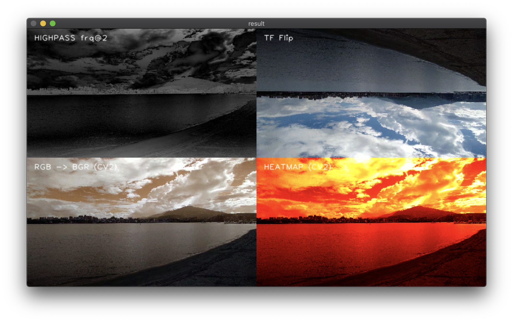

# NTOU CS Computer Vision Homework Collection

 

## Requirements
- pipenv
- pyenv (optional)
- Python 3rd-party packages
  - opencv-python
  - numpy
  - matplotlib
  - pillow
  - tensorflow
  - pre-commit
  - scipy

## Before anything
- This repo is developed based on Python 3.9.1 on pipenv
- Run `pipenv install` to install dependencies
- Put all medias into `data/` (Recommended)

---

## HW1 - Video Filter
### Overview
- Contians 4 frame filters
  - RGB -> BGR (CV2)
  - Heatmap (CV2)
  - Flip upside down (TF)
  - High Pass

### Dive into the code
  - Entry `hw1_filter/__main__.py`
  - To run it, `pipenv run hw1 --source <path-to-input-video>`
  - Arguments
    - `--source <path-to-input-video>`
      - Specify the input video.
      - **Required**
    - `--output <path-to-output-video>`
      - Specify the out video.
      - Optional, if not provided, there will be no output.

### Result
- `pipenv run hw1 --source ./data/homework_1_test_video.mp4 --output ./data/out.mp4`
  
- [Output result on YouTube](https://youtu.be/LP67pJAgVWo)

---

## HW3 - Stitching
### Overview
- Stitchs frames or video into one picture

### Dive into the code
  - Entry `hw3_stitching/__main__.py`
  - To run it, `pipenv run hw3 --source <path-to-input> --type < video | frames > --reverse < true > --direction < ltr | rtl >`
  - Arguments
    - ` --type < video | frames >`
      - Input type, default is video
    - `--source <path-to-input>`
      - Input path, if frames are specified, it must be a path to a folder contains frames.
      - **Required**
    - `--reverse true`
      - Specify if the input video should be reversed.
      - Optional.
    - `--direction < ltr | rtl >`
      - Specify if the input video direction.
      - Optional, default is rtl.
    - `--minmatch <number>`
      - Specify minium match points, if match points is less than specified number, the frame will not be stitched.
      - Optional, default is 500.

### Result
- `pipenv run stitch --source data/data_hw3/dataset1.mp4 --type video --direction ltr --reverse true`
  
  - [Output result on YouTube](https://youtu.be/T1S0uYMyGnE)
- `pipenv run stitch --source data/data_hw3/dataset2/ --type frames --minmatch 500`
  
  - [Output result on YouTube](https://youtu.be/8_rakGqP_tU)

---

## HW4 - CNN Fruits Recognition
### Overview
- Create a fruits recognition model.

### Dive into the code
  - Entry `hw4_CNN/__main__.py`
  - To run it, `pipenv run hw4 --mode < load | train > --model < DenseModel | DenseBlockModel > --modelpath <path-to-trained-model> --trainpath <path to training dataset> --testpath <path to testing dataset>`
  - Arguments
    - `--mode < load | train > `
      - Specify the behave of the program, either load a trained model to test or train a new model.
      - **Required**
    - `--model < DenseModel | DenseBlockModel > `
      - Select training mode.
      - **Required**
    - `--modelpath`
      - If mode is 'load', use this to provide the path to the model.
    - `--trainpath`
      - Path to Datasets for training.
      - **Required**
    - `--testpath`
      - Path to Datasets for tesging.
      - **Required**